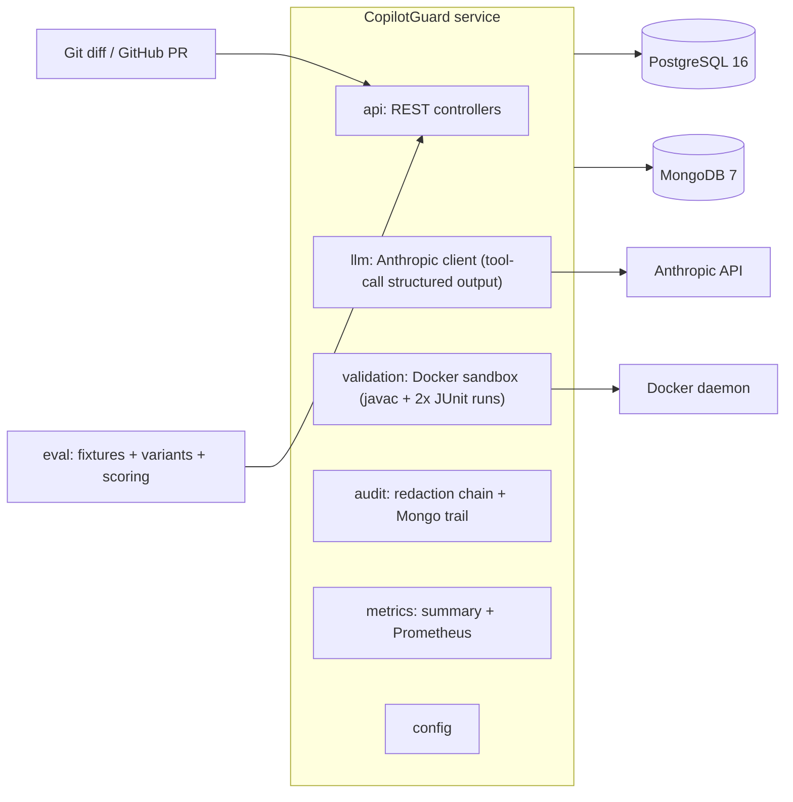

# CopilotGuard

## Problem

AI-generated code review and test generation can draft thousands of lines in seconds,
but model output is probabilistic: suggested tests may not compile, may assert the wrong
behavior, may be flaky, and review comments may be hallucinated. Teams cannot safely let
that output into their repositories, and they cannot audit what was sent to the model
or why. CopilotGuard closes that loop: it reviews diffs and generates tests with an LLM,
then **proves** the output before it is trusted - every generated test is compiled and
executed twice in an isolated Docker sandbox, every prompt and response is recorded in an
immutable audit trail, secrets are redacted before anything leaves for the model, and
only output that passes the governance layer (plus explicit human verdicts) is ever
accepted. There is no code path that merges or returns unvalidated AI output.

## Architecture



## Quickstart

```sh
cp .env.example .env            # set ANTHROPIC_API_KEY
docker compose up --build       # postgres:16, mongo:7, service
```

Review a sample diff:

```sh
curl -sS -X POST http://localhost:8080/api/v1/reviews \
  -H 'Content-Type: application/json' \
  -d '{
    "diff": "diff --git a/src/main/java/com/example/Report.java b/src/main/java/com/example/Report.java\n--- a/src/main/java/com/example/Report.java\n+++ b/src/main/java/com/example/Report.java\n@@ -8,6 +8,9 @@ public class Report {\n     public String summarize(List<String> items) {\n         StringBuilder out = new StringBuilder();\n+        for (int i = 0; i <= items.size(); i++) {\n+            out.append(items.get(i)).append('\\''\\n'\\'');\n+        }\n         return out.toString();\n     }",
    "allowRedactedSend": false
  }' | jq
```

Sample response (abridged):

```json
{
  "runId": 7,
  "status": "SUCCEEDED",
  "promptTemplateId": "generate_tests:v1",
  "tokenInput": 2100,
  "tokenOutput": 1100,
  "costUsd": 0.0228,
  "generatedTests": [
    {
      "filePath": "src/test/java/com/example/ReportCoverageTest.java",
      "compileStatus": "SUCCESS",
      "passStatus": "PASSED",
      "validationStatus": "PASSING",
      "accepted": true,
      "content": "package com.example; ..."
    }
  ],
  "comments": [
    {
      "id": 21,
      "filePath": "src/main/java/com/example/Report.java",
      "line": 11,
      "severity": "BLOCKER",
      "category": "BUG",
      "body": "Off-by-one: loop bound exceeds collection size\n\nSuggested fix: Use < instead of <="
    }
  ]
}
```

## API

| Endpoint | Purpose |
| --- | --- |
| `POST /api/v1/reviews` | Run a review: `{diff}` or `{owner, repo, prNumber}`; optional `conventions`, `allowRedactedSend`, `testPromptTemplateId`, `reviewPromptTemplateId` |
| `GET /api/v1/reviews/{id}/audit` | Immutable audit trail (redacted prompts, raw responses, validation verdicts) |
| `POST /api/v1/reviews/{id}/comments/{commentId}/verdict` | Record the human `ACCEPT`/`REJECT` on a comment |
| `GET /api/v1/metrics/summary` | Test pass rate, mean token cost, human-override rate, rejection reasons histogram |
| `GET /api/v1/health` | Health (Actuator-backed) |
| `GET /actuator/prometheus` | Prometheus metrics |

## Responsible-AI governance

- **Redaction chain.** Before any content leaves for the model, the diff runs through
  regex detectors (AWS keys, PEM private-key blocks, JWTs, bearer tokens, credential
  connection strings, emails, SSN-shaped numbers, Luhn-checked card numbers) that replace
  matches with stable placeholders (`[REDACTED:AWS_KEY:1]`). Blocker-class secrets abort
  the run with HTTP 422 unless the caller sets `allowRedactedSend=true`; every hit is
  recorded in the audit document.
- **Audit trail.** Every run writes immutable MongoDB `prompt_audit` documents containing
  the redacted prompt, the raw response, template id/version, model id, token usage, and
  redaction hits. Unredacted source is never persisted - tests assert this.
- **No-auto-merge rule.** There is no code path that merges, commits, or returns
  unvalidated AI output. Tests are classified in Docker (`COMPILE_FAIL` / `TEST_FAIL` /
  `FLAKY` / `PASSING`); only `PASSING` tests are returned as accepted output, everything
  else is stored with its failure reason.
- **Human override loop.** Review comments carry a `human_verdict` (PENDING/ACCEPTED/
  REJECTED). Humans record verdicts through the verdict endpoint; the override rate and
  rejection reasons feed the metrics summary and Prometheus gauges, closing the
  measurement loop on model quality.

## Evaluation

The harness in `eval/` scores three prompt variants per task (baseline, few-shot,
chain-of-thought-with-rubric) across 16 fixture diffs (4 planted defects: off-by-one,
null dereference, missing auth, SQL injection; 4 clean diffs for false positives).
Results from the committed run (`eval/results/20260916T032858Z.*`, produced through the
real service with the deterministic model stub `eval/mock_anthropic.py` - rerun with a
real `ANTHROPIC_API_KEY` for production numbers):

| variant | pass rate | defect recall | false-positive rate | cost per review | mean latency |
| --- | --- | --- | --- | --- | --- |
| baseline | 0.875 | 0.500 | 1.000 | $0.0228 | 2.81 s |
| few_shot | 0.875 | 0.750 | n/a | $0.0228 | 2.74 s |
| cot_rubric | 0.875 | 1.000 | n/a | $0.0228 | 2.81 s |

## Repository

| Path | Purpose |
| --- | --- |
| `service/` | Java 21 + Spring Boot 3.3 service (Maven) |
| `eval/` | Python 3.12 evaluation harness, fixtures, results |
| `.github/workflows/` | CI (tests, format, coverage, Trivy), CD (multi-arch image, Azure OIDC deploy), dogfooding self-review |
| `deploy/openshift/` | Alternative OpenShift deployment manifests |
| `docs/adr/` | Architecture decision records |

See [CONTRIBUTING.md](CONTRIBUTING.md) for the development workflow and the
[ADRs](docs/adr/) for the rationale behind validation-in-Docker, the Mongo audit store,
and structured tool-use output.
