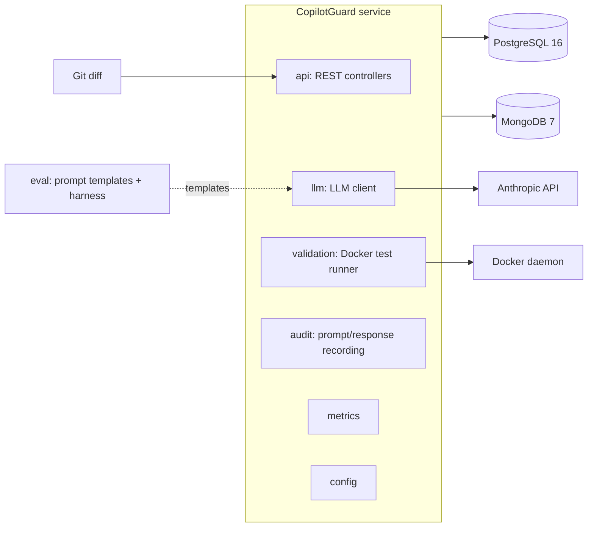

# CopilotGuard

Skeleton service that takes a Git diff, uses an LLM to generate unit/integration
tests and review comments, validates generated tests by running them in Docker,
and records every prompt and response for audit.

> Status: skeleton only. Business logic is not implemented yet.

## Layout

| Path       | Purpose                                                        |
| ---------- | -------------------------------------------------------------- |
| `service/` | Java 21 + Spring Boot 3.3 service, built with Maven            |
| `eval/`    | Python 3.12 evaluation harness with versioned prompt templates |
| `docker-compose.yml` | PostgreSQL 16, MongoDB 7, and the service            |

## Architecture



## Local development

1. Copy `.env.example` to `.env` and set `ANTHROPIC_API_KEY`.
2. `docker compose up --build`
3. Health check: `curl localhost:8080/api/v1/health`
4. Actuator: `curl localhost:8080/actuator/health`

## Building the service

```sh
cd service
mvn verify
```

## Running the eval harness

```sh
cd eval
python3.12 -m venv .venv
.venv/bin/pip install -e ".[dev]"
.venv/bin/pytest
```

## Data model

- PostgreSQL (`review_run`, `generated_test`, `review_comment`) via Spring Data JPA + Flyway.
- MongoDB (`prompt_audit`) via Spring Data MongoDB for the immutable audit trail.
