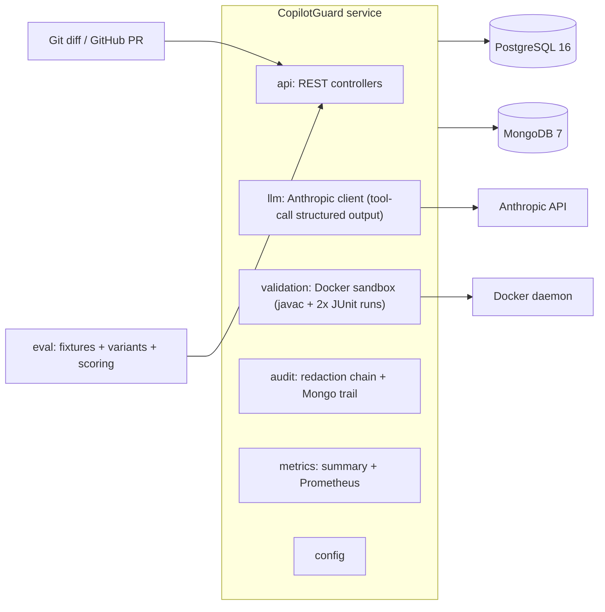

# CopilotGuard

Service that takes a Git diff, uses an LLM to generate unit/integration tests and review
comments, validates generated tests by running them in an ephemeral Docker sandbox, and
records every prompt and response for audit. AI output is never merged or committed
unvalidated: only tests that compile and pass are returned as accepted output.

## Layout

| Path       | Purpose                                                        |
| ---------- | -------------------------------------------------------------- |
| `service/` | Java 21 + Spring Boot 3.3 service, built with Maven            |
| `eval/`    | Python 3.12 evaluation harness, benchmark fixtures, results    |
| `docker-compose.yml` | PostgreSQL 16, MongoDB 7, and the service            |

## Architecture



## API

| Endpoint | Purpose |
| --- | --- |
| `POST /api/v1/reviews` | Run a review: `{diff}` or `{owner, repo, prNumber}`; optional `conventions`, `allowRedactedSend`, `testPromptTemplateId`, `reviewPromptTemplateId` |
| `GET /api/v1/reviews/{id}/audit` | Immutable audit trail (redacted prompts, raw responses, validation verdicts) |
| `POST /api/v1/reviews/{id}/comments/{commentId}/verdict` | Record human `ACCEPT`/`REJECT` on a comment |
| `GET /api/v1/metrics/summary` | Test pass rate, mean token cost, human-override rate, rejection reasons histogram |
| `GET /api/v1/health` | Health (Actuator-backed) |
| `GET /actuator/prometheus` | Prometheus metrics (`copilotguard_tests_pass_rate`, `copilotguard_reviews_mean_cost_usd`, `copilotguard_comments_override_rate`, `copilotguard_comments_rejected_total`) |

Review pipeline: diff parse -> redaction chain (blocker secrets fail the run unless
`allowRedactedSend=true`) -> prompt templates (3 variants per task: baseline, few-shot,
chain-of-thought-with-rubric) -> Anthropic tool-call structured output -> Docker
validation (javac compile + 2 JUnit runs, classified COMPILE_FAIL / TEST_FAIL / FLAKY /
PASSING) -> deterministic convention checks -> Postgres + Mongo persistence.

## Local development

1. Copy `.env.example` to `.env` and set `ANTHROPIC_API_KEY`.
2. `docker compose up --build`
3. Health check: `curl localhost:8080/api/v1/health`
4. Actuator: `curl localhost:8080/actuator/health`

## Building the service

```sh
cd service
mvn verify
```

## Running the eval harness

```sh
cd eval
python3.12 -m venv .venv
.venv/bin/pip install -e ".[dev]"
.venv/bin/pytest                                  # scoring tests, no API key required
.venv/bin/python run_eval.py --base-url http://localhost:8080
```

The harness runs 3 prompt variants x 16 fixtures through the real service and writes
`eval/results/<timestamp>.json`, a Markdown table, and a bar chart.

### Committed results

`eval/results/20260916T032858Z.*` were produced against the real service (Postgres,
Mongo, Docker validation) with a deterministic local model stub
(`eval/mock_anthropic.py`) because no API key is required for reproducible runs. Rerun
with a real `ANTHROPIC_API_KEY` for production numbers.

| variant | compile rate | pass rate | defect recall | false-positive rate | mean cost (USD) | mean latency (ms) |
| --- | --- | --- | --- | --- | --- | --- |
| baseline | 0.875 | 0.875 | 0.500 | 1.000 | 0.0228 | 2805.9 |
| few_shot | 0.875 | 0.875 | 0.750 | n/a | 0.0228 | 2738.9 |
| cot_rubric | 0.875 | 0.875 | 1.000 | n/a | 0.0228 | 2809.2 |

## Data model

- PostgreSQL (`review_run`, `generated_test`, `review_comment`) via Spring Data JPA + Flyway.
- MongoDB (`prompt_audit`) via Spring Data MongoDB for the immutable audit trail.
